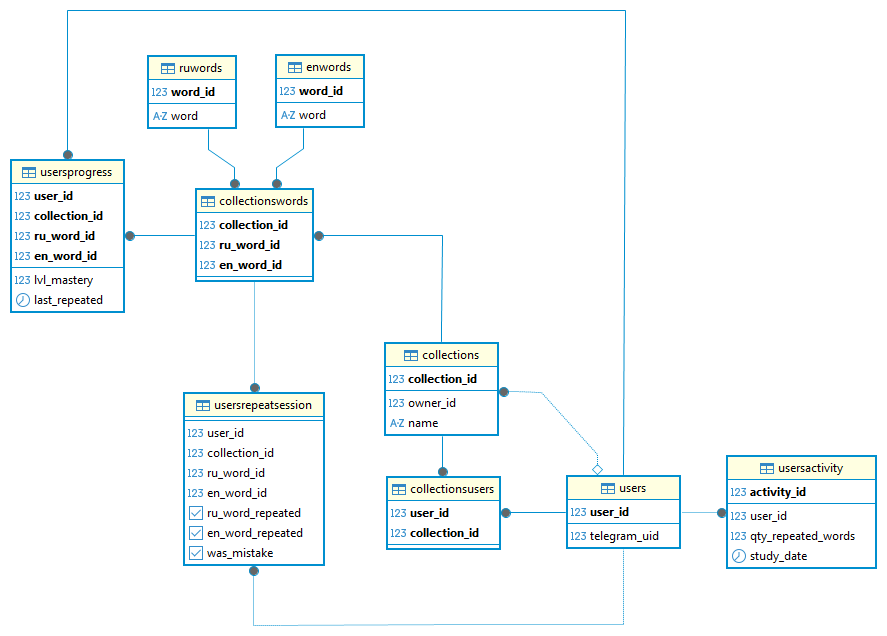
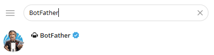
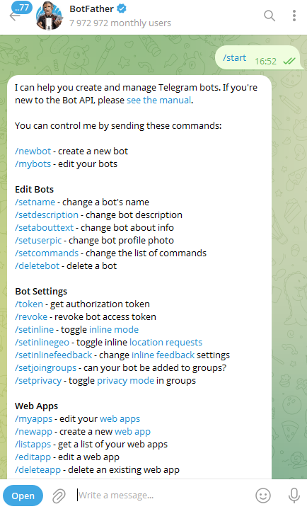
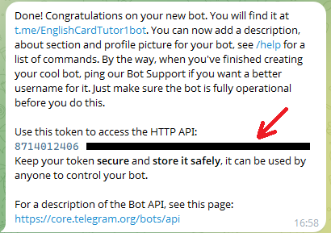

# EnglishCardsTelegramBot

Telegram bot for learning English words using spaced repetition.

## Table of contents
  * [Overview](#Overview)
  * [Project Structure](#ProjectStructure)
  * [Database Structure](#DatabaseStructure)
  * [Setup and Installation](#SetupandInstallation)
    * [PostgreSQL](#PostgreSQL)
    * [Python](#Python)
    * [TelegramBot](#TelegramBot)
  * [Demonstration of the program](#Demonstrationoftheprogram)

## Overview

The project is implemented in Python 
using the PyTelegramBotAPI, psycopg2

### Key Features:
1. Create separate collections for easier word learning
2. Easily interact with collections through the dictionary: add, delete, viewing words
3. Pre-made word set of the most common foreign words
4. Spaced repetition for better memorization of learned words
5. Personal progress statistic

## Project Structure

```
EnglishCardsTelegramBot /
├── data/
│   └── collections/ # directory for basic sets of words
│       └── General.csv # basic set of words
├── images/ # photos for README
├── src/
│   ├── logger.py - logger initializer
│   ├── setup_config.py - setting config creator
│   ├── bot/
│   │   ├── bot.py - telegram bot description logic
│   │   ├── defines.py - constants for bot
│   │   ├── collection.py - interaction with collections
│   │   ├── repeat_words.py - repeatition session
│   │   └── service.py - service functions
│   └── db/ 
│       ├── sql/
│       │   └── create_tables.sql - creation database sctructure logic
│       ├── init.py - database initialization
│       ├── connection.py - database connection decorator
│       ├── activity.py - interaction with UserActivity table
│       ├── collection.py - interaction with collections and words
│       ├── repeat_session.py - interaction with UsersRepeatSession table
│       ├── service.py - database initial functions
│       ├── statistic.py - user statistic get functions
│       ├── user_progress.py - updating user progress
│       └── users.py - interaction with Users table
├── requirements.txt - project requirements
└── README.md
```

## Database Structure



### Tables List:
* *Users* - telegram uid list for each user
* *UserActivity* - registration of user activities
* *UserProgress* - user progress in learned words
* *UserRepeatSession* - table for temporarily storing words during a user's learning session
* *Collections* - collection info
* *CollectionsUsers* - available collections for user
* *CollectionsWords* - listing the russian and english word IDs for each collection
* *RuWords* - list of russian words
* *EnWords* - list of english words

## Setup and Installation

### PostgreSQL

This project uses PostgreSQL for data storage.


1. Installing and setting-up PostgreSQL server following this [guide](https://medium.com/@dan.chiniara/installing-postgresql-for-windows-7ec8145698e3)
2. Log into the psql client via the terminal using the admin account
   
   ```$ psql -U <admin_username>```

3. Create new user (optional)

   ```postgres=# CREATE USER username WITH PASSWORD 'username_password';```

4. Create database
   
   ```postgres=# CREATE DATABASE database_name;```

### Python

This project depends on Python version 3.12 or higher.

1. Cloning repository
   
   ```$ git clone https://github.com/samboed/EnglishCardsTelegramBot ``` 

2. Go to the cloned directory
   
   ```$ cd EnglishCardsTelegramBot ``` 

3. Create virtual environment
   
   ```$ python -m venv .venv ``` 

4. Activate virtual environment:

* Windows (CMD): ```$ .venv\Scripts\activate.bat```
* Windows (PowerShell): ```$ .venv\Scripts\Activate.ps1```
* Linux: ```$ .venv\Scripts\activate```

5. Install requirements
   
   ```$ pip install -r requirements.txt```

### TelegramBot

To use the program, you need a Telegram bot API token.

1. Find [@botfather](https://telegram.me/BotFather) in the Telegram messenger search

   

2. Start the bot with the ```/start``` command

   

3. Select the ```/newbot``` command from the menu
4. Give ```name``` and ```username``` to your bot

   

5. BotFather will give you a ```token```

   

## Running the Program

1. Run main.py from pre-configured virtual environment

   ```$ python main.py```

3. Fill the configuration file setup.ini:

   ```
   [DATABASE]
   name = database_name
   username = username 
   password = username_password
   
   [TELEGRAM]
   token = token_telegram_bot
   ```

3. Run main.py from pre-configured virtual environment:

   ```$ python main.py```

## Demonstration of the program

[](https://www.youtube.com/watch?v=ZCDoOLdQH0Y)


